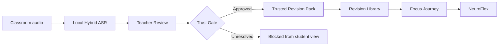

# SHRAVYA

> **Every class, made clear.**

**Teacher-verified classroom audio → accessible revision**

Shravya is a Malayalam-first, teacher-controlled classroom-to-revision platform built for **INCLUCODE 2026** by **Team jaiRAM**.

A learner can understand a class — and still leave without the lesson.

Deaf and hard-of-hearing learners may already be watching an interpreter, reading captions, or speechreading. Learners with dysgraphia or writing-related access needs may understand the lesson but struggle to produce complete notes at classroom speed.

Shravya turns one classroom recording into a **trusted, revisitable learning experience**.

---

## The idea

> **AI assists the teacher. The teacher remains the source of classroom truth.**

Shravya does **not** send raw AI output directly to students.

It keeps transcription evidence behind a teacher-controlled boundary, supports correction and terminology review, and only releases content after the classroom version is approved.

**Nothing crosses until approved.**

---

## From classroom audio to trusted revision



### 1. Capture
A teacher uploads a classroom WAV recording.

### 2. Local Malayalam hybrid ASR
The demonstrated local pipeline combines:

- **faster-whisper** for speech boundaries and timestamp evidence
- **AI4Bharat IndicConformer** for Malayalam-script draft transcription

The demonstrated workflow runs locally with packaged models and does not require a paid transcription API.

### 3. Teacher Review
The teacher can:

- inspect the transcript
- correct recognition errors
- review academic terminology
- verify the classroom context

### 4. Trust Gate
The workflow fails closed when required checks are unresolved.

Only approved canonical content can enter the student experience.

### 5. Trusted Revision
An approved class becomes a structured revision pack rather than a raw transcript.

---

# TRUST. ACCESS. ADAPT.

## TRUST

### Teacher Verification
AI evidence remains behind the teacher boundary.

### Terminology Gate
Academic terms can be reviewed and corrected before student release.

### Versioned classroom truth
Approved classroom contexts remain traceable and revisitable instead of being silently overwritten.

---

## ACCESS

### Revision Library
Every approved class can become a dated revision pack.

Students can revisit:

- the current approved version
- earlier approved classroom sessions
- trusted lesson content tied to the correct classroom version

Drafts and review-state versions remain hidden.

### Trusted Vocabulary
Approved academic terms can open into:

- canonical English term
- Malayalam support label
- teacher-approved definition
- Malayalam explanation

The prototype also demonstrates an optional, attributed external **ISLRTC** educational resource for one verified vocabulary term. External sign-language resources are supplementary and do not replace an interpreter or formal accommodation.

### Reading & Comfort Settings
Learners can personalize presentation without changing lesson progress:

- text size
- text spacing
- default / high-contrast / dark display
- reduced motion
- optional Atkinson Hyperlegible mode
- persistent browser-level preferences

Accessibility is treated as a **learner-controlled experience, not a fixed mode**.

---

## ADAPT

### Focus Journey
Lessons are broken into manageable steps so learners can move through trusted content without facing the full information load at once.

### NeuroFlex
When a learner gets stuck, NeuroFlex changes the support — not the answer.

**Cue → Example → Alternate explanation → Try again**

The learner returns to the same question after support rather than receiving the answer immediately.

---

## Built for the real classroom problem

Shravya is designed around the needs of:

- deaf and hard-of-hearing learners
- learners with dysgraphia or writing-related access needs
- Malayalam and Malayalam-English code-mixed classrooms
- learners who benefit from reduced information load or alternate explanations
- teachers who need control over AI-generated educational content

Shravya is **not** intended to replace teachers, interpreters, note-takers, or formal accommodations.

It is designed to help preserve what the teacher taught in a form the learner can revisit.

---

## Local-first trust architecture

The demonstrated ASR path keeps classroom audio processing on-device.

```text
Classroom audio
      ↓
Local Hybrid ASR
      ↓
Teacher correction
      ↓
Terminology review
      ↓
Fail-closed quality gate
      ↓
Teacher approval
      ↓
Approved canonical context
      ↓
Revision Library + Focus Journey + NeuroFlex
```

### Why local-first?

- no paid transcription API is required for the demonstrated workflow
- raw classroom audio does not need to leave the demo device for transcription
- teacher review remains mandatory
- drafts and unresolved content stay outside student view

Local processing still has ordinary device, storage, accuracy, and operational risks. Shravya does not claim zero privacy risk.

---

## What is working today

The INCLUCODE competition prototype includes:

- local Malayalam/code-mixed transcription workflow
- faster-whisper + IndicConformer hybrid path
- teacher correction and approval
- academic terminology review
- fail-closed trust gate
- approved-only student projection
- versioned classroom contexts
- Revision Library
- Trusted Vocabulary
- Focus Journey
- NeuroFlex guided recovery
- Reading & Comfort Settings
- optional attributed ISLRTC vocabulary resource
- deterministic demo fallback for resilient judging

---

## Verification checkpoint

At the final competition checkpoint:

| Verification | Result |
|---|---:|
| Backend tests | **279 passed** |
| Frontend tests | **97 passed** |
| Playwright judge-flow tests | **9 passed** |
| Local Malayalam hybrid inference | **Passed on demo laptop** |
| Teacher → approved student revision flow | **Verified end-to-end** |

These numbers describe the locked competition checkpoint and may change as the repository evolves.

---

## Technology

### Frontend
- React
- TypeScript
- Vite
- Vitest
- Testing Library
- Playwright

### Backend
- FastAPI
- Python 3.11
- SQLAlchemy
- SQLite
- Alembic
- Pydantic

### Speech recognition
- faster-whisper
- CTranslate2
- AI4Bharat IndicConformer 600M Multilingual
- Malayalam CTC decoding

---

## Repository structure

```text
shravya-inclucode/
├── backend/       FastAPI application, services, models, migrations and tests
├── frontend/      React/TypeScript teacher and student experience
├── shared/        Shared API contract snapshot
├── docs/          Accessibility and implementation documentation
├── scripts/       Development and startup utilities
└── .runtime/      Gitignored local runtime data, models and audio evidence
```

Do not commit classroom recordings, consent material, private learner data, local benchmark evidence, or model/runtime artifacts.

---

## Run locally

### Prerequisites

- Python 3.11
- Node.js 24.x
- npm 11.x
- Windows PowerShell for the provided startup scripts

No Docker is required for the competition prototype.

### Install

```powershell
# Backend
.\.venv\Scripts\python.exe -m pip install -e ".\backend[dev]"

# Frontend
npm --prefix frontend install

# Local configuration
Copy-Item .env.example .env
```

### Database

```powershell
Push-Location backend
..\.venv\Scripts\python.exe -m alembic upgrade head
Pop-Location
```

### Start backend

```powershell
.\scripts\start-backend.ps1
```

### Start frontend

```powershell
npm --prefix frontend run dev
```

The interface includes local demo navigation for teacher and student views. It is demonstration navigation, not production authentication.

---

## Transcription modes

### Deterministic demo

```text
SHRAVYA_PROVIDER_MODE=deterministic_demo
```

A bundled, fail-closed fixture used for resilient demonstration and automated testing.

### Local faster-whisper

```text
SHRAVYA_PROVIDER_MODE=local_faster_whisper
```

Runs faster-whisper locally.

### Local Malayalam hybrid

```text
SHRAVYA_PROVIDER_MODE=local_malayalam_hybrid
```

Combines local faster-whisper timing evidence with the separately provisioned IndicConformer runtime for Malayalam-script draft transcription.

Model/runtime paths are configured through `.env.example`.

---

## Run tests

```powershell
# Backend
.\.venv\Scripts\python.exe -m pytest backend

# Frontend
npm --prefix frontend run test

# Browser-level flow
npm --prefix frontend run test:e2e
```

### Formatting and linting

```powershell
.\.venv\Scripts\python.exe -m ruff format backend
.\.venv\Scripts\python.exe -m ruff check backend
npm --prefix frontend run lint
```

---

## Honest scope

Shravya is a **functional competition prototype**, not a clinically validated educational intervention.

### Demonstrated
- local Malayalam/code-mixed transcription
- teacher-controlled correction and approval
- approved-only student content
- Revision Library
- Focus Journey
- NeuroFlex
- reading and comfort controls
- end-to-end local judge flow

### Not claimed
- perfect Malayalam transcription
- live captions
- universal offline operation
- zero privacy risk
- clinical validation
- proven learning-outcome improvement
- automatic detection of every uncertain word

---

## Validation status

A formative review with a **Special Educator at NIPMR** recognised the problem and product direction as meaningful.

The next phase is structured learner and classroom validation:

- repeated classroom use
- teacher verification time
- learner usefulness
- reading-preference usage
- NeuroFlex usefulness
- multi-lesson and multi-subject expansion

> **The prototype works. Now the question is whether it meaningfully changes the classroom experience.**

---

Built for **INCLUCODE 2026 — Inclusive Software Innovation Buildathon**.

---

## License

Shravya project code is released under the **MIT License**.

Bundled third-party assets, including fonts, retain their respective licenses and notices.

---

# The lesson happened once.

## The learner should not lose it forever.

**Shravya — Every class, made clear.**
